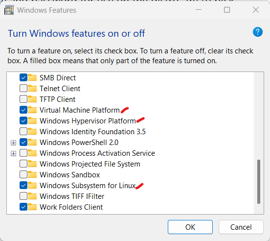
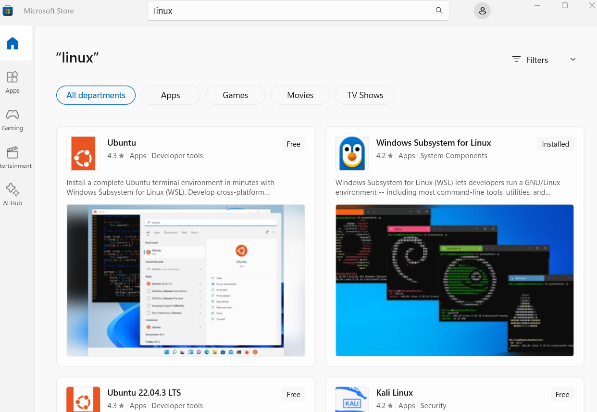
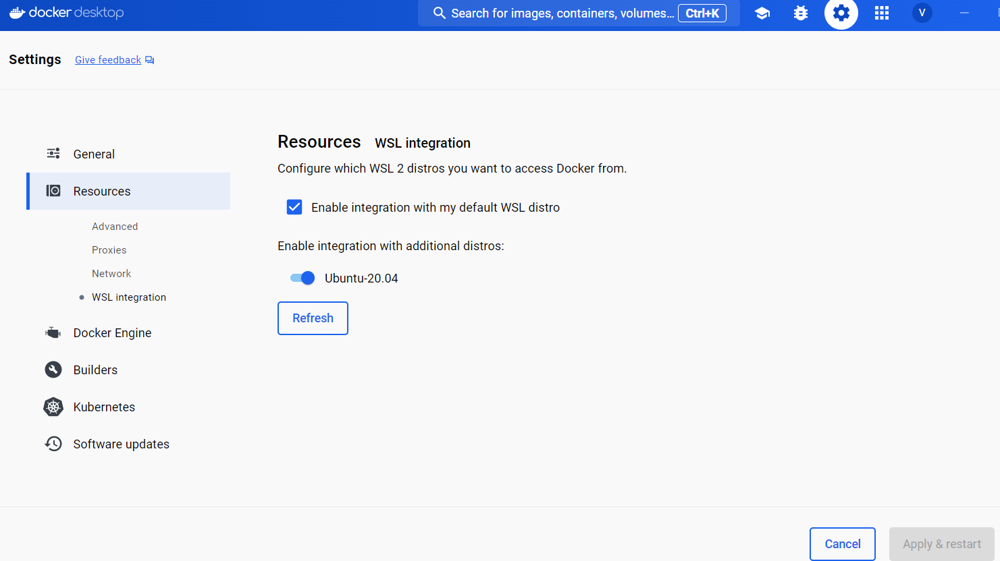
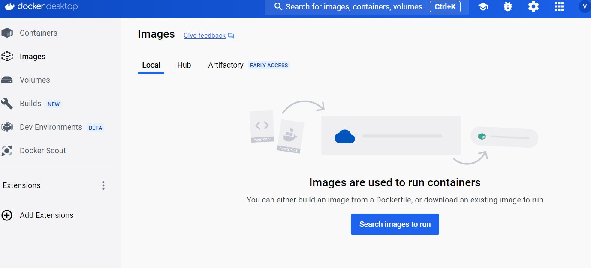
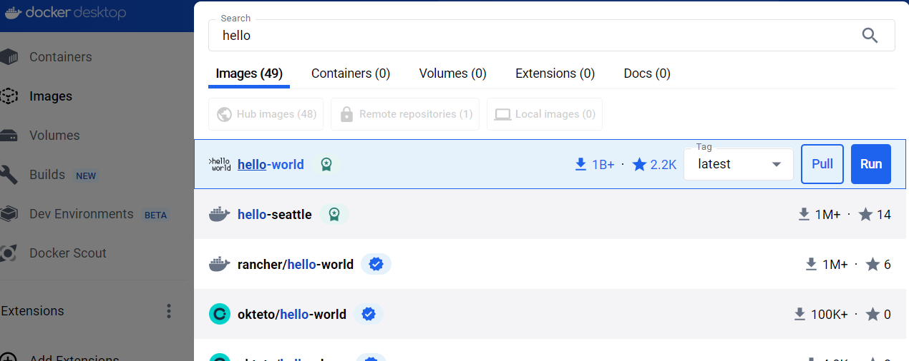

# Installing Docker Desktop on Windows 11

## Follow the instructions to install Docker Desktop on Windows 11

### Pre-requisites
- Ensure you have administrative rights on the windows system, since the docker install will ask for it.
- Ensure you have internet access to download the installer
- Ensure you have permissions to the local drive to store the downloads ( usually in C drive )

### Let's get on with it....


### Step 1 - Enable Hardware virtualization
 
Ensure that the hardware virtualization support option is turned on in the BIOS settings.

 


### Step 2 - Enabled Windows features
 
Click the Windows logo on the taskbar and start typing
"Windows features"
Click on it and you can select the below highlighted in red
click OK.



### Step 3 - Download the docker desktop installer

Head over to the url here :point_right: [Docker Desktop for Windows](https://docs.docker.com/desktop/install/windows-install/)  

Save the download to some location in C drive ( downloads directory may be..)

Execute the installer and follow the on-screen instructions.

Do restart if it asks for it to complete the installation.

### Step 4 - Check the WSL in windows

Open the command prompt from the start.

Type `wsl -l` to display the current wsl being used.

``` 
Windows Subsystem for Linux Distributions:
Ubuntu-20.04 (Default)
docker-desktop
docker-desktop-data 
```
for us to have the Ubuntu as the default wsl, we will have to install it from the microsoft store for free.

### Step 5 - Install the Ubuntu terminal

Open the microsoft store and search for linux as shown below and install the ubuntu version as desired.



Once installed, it will prompt you to set an account with username and password. Please do that.

after this step, you can run the `wsl --set-default <your ubuntu version>`

you should now see this get reflected in docker desktop under settings as below



<br>
<br>
Search of the hello world images..


<br>
<br>
Run the hello world image to see if it works fine..




Happy dockerING !!! :smiley: